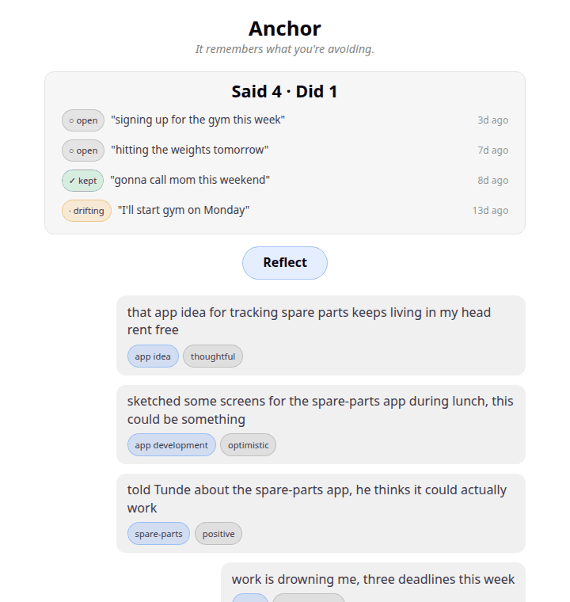

# Anchor

**The first app that tracks the gap between your words and your actions — and shows you the receipts.**

*Your journal knows what you said. Your tracker knows what you did. Anchor knows the difference.*

> "It remembers what you're avoiding."

Built for the **BTL Runtime Hackathon** (July 2026). A thinking companion, not therapy.



## The problem

Every AI chatbot forgets you between conversations, and your notes app remembers everything but notices nothing. Meanwhile the most important data you produce every day — the promises you make to yourself in passing — evaporates. Anchor catches those promises from natural language, watches whether your own later words ever report follow-through, and tells you the truth about the gap, with citations.

## How it works

```
you text it freely
      │
      ▼
┌──────────────┐  cheap model, every message
│    TAGGER    │  topic · mood · is-commitment
└──────────────┘
      │
      ▼
┌──────────────┐  the scoreboard: "Said 4 · Did 1"
│    LEDGER    │  every promise stays open until your own words
└──────────────┘  close it (kept) or silence closes it (drifting)
      │
      ▼
┌──────────────┐  pure math: threads that went quiet ≥14 days
│   SILENCES   │  "3 weeks quiet on the app idea — dropped, or resolved?"
└──────────────┘
      │
      ▼  (only when you hit Reflect)
┌──────────────┐  strong model, on demand, streamed
│  REFLECTOR   │  every claim cites the exact source messages —
└──────────────┘  tap a claim, see the receipts
```

- **Catch the words** — every message is tagged by the cheap model (topic, mood, commitment detection). No configuration; promises are detected from how you naturally write.
- **Watch the follow-through** — a detected promise opens a ledger entry. When a later message reports actually doing it, a cheap-model check flips it to **kept** — live, in front of you. Promises with no follow-through drift.
- **Prove everything** — reflections are structured claims, each carrying the ids of the messages it rests on. Tap any claim → the exact quotes with dates fold out. Receipts, never vibes.
- **Hear the silences** — threads that were active and went quiet get flagged, so the reflection can ask the question a good friend would.
- **Notice the change** — each reflection receives the previous one, and names one thing that changed and one that didn't.

## BTL runtime usage

Every LLM call goes through the BTL gateway, and each feature is load-bearing:

| Runtime feature | Where it lives |
|---|---|
| Agents | The signal-vs-noise pipeline: `tagMessage()` → ledger engine (`patterns.js`) → silence detection → reflection synthesis |
| Retrieval & Memory | The entire product: full-history evidence building (`buildEvidence()`), previous-reflection delta |
| Embeddings | The gateway's `/v1/embeddings` route was not enabled during the event (confirmed with organizers) — thread grouping (`findThreads()`) and follow-through matching (`checkFollowThrough()`) run on batched cheap-model calls instead, through the same gateway |
| Streaming | The live reflection: gateway `stream:true` accumulated server-side, streamed to the browser over SSE (`GET /reflect`) |
| Cost-based model routing | Cheap model always-on (tagging, grouping, yes/no checks) vs. strong model rarely (reflection synthesis) — real cost asymmetry, visible in the app |
| Usage & Billing | The CostBar: real token counts per tier from the gateway's `usage` field (`GET /stats`), strong-tier streaming costs estimated and labeled |

## Run it locally

```bash
# 1. clone and configure
git clone https://github.com/Ejirowebfi/Anchor.git && cd Anchor
cp backend/.env.example backend/.env   # add your BTL gateway key

# 2. backend
cd backend && npm install && npm start

# 3. frontend (new terminal)
cd frontend && npm install && npm run dev   # open http://localhost:5173
```

Optional: `node backend/seed.js` loads a demo journal; `node backend/rebuild-ledger.js` builds the ledger from it.

## What's next

- **Shared commitments** — the flagship idea: two people see each other's ledgers; accountability with receipts.
- `/search` — "when did I last feel like this?" over the full history.
- Time-decay weighting, deployment, and a commitment-ledger export.

---

*Anchor — it remembers what you're avoiding.*
